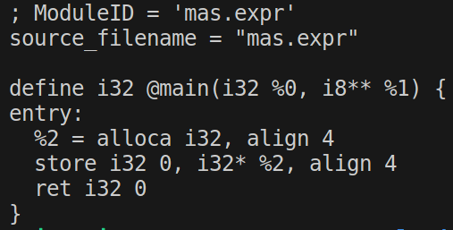

# LLVM Compiler Project 2023
Hi! This is MAS-Lang! A useless but tricky language and we have designed a compiler for it in C++ !

This language supports:

## Defining integer variables    
```
// Examples:

int a, b, c = 0, 1, 2;
int a, b, c = 0, 1;
int a, b;
```

## Assigning integer variables    
```
// Examples:

a = 0;
a += 1;
a -= 2;
a *= 3;
b /= 4;
c %= 5;
```

## If, Elif and Else   
```
// Examples:

if a > 3 and b == 10 or false: begin a = 5; end
elif a==3 and true: begin
c *= 10;
end
else: begin
c += 1; end

if true and 2>1: begin
   if a > 3 and b >= 10 or false: begin a = 5; end
   else: begin c *= 1; end
end

```

## Loop   
```
// Examples:

loopc a > 3 and b <= 10 or false: begin a = 5;
  a = 5;
  b = (a * 4) + 5 * (7 - 2) / 1;
  if (a > 10) and b == 20:
    begin
      b *= 10;
    end
end
```

## How to use?
**1-** Install llvm compiler on your computer (for step by step installation: **https://vrgl.ir/t9N3n** )

**2-** Run the makeBuild.sh by ``` ./makebuild.sh ``` or the below commands:
```
$ mkdir build
$ cd build
$ cmake ..
$ make
$ cd code
$ ./MAS-Lang "int a;"
```

The results would be the IR code like this:



In case of any issue or problem, let us know in the Issues section!
